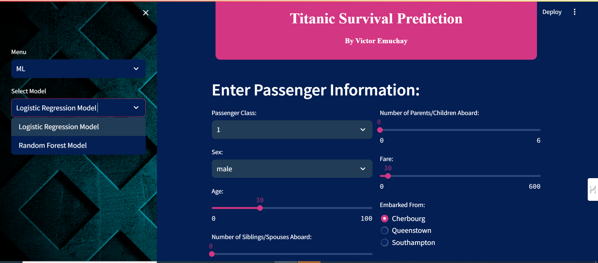

Sure, here's a README for the provided code:

---

# Titanic Survival Prediction Web App

## Overview

The Titanic Survival Prediction Web App is a Streamlit-based application designed to predict the likelihood of survival for passengers aboard the Titanic. Utilizing machine learning techniques, the app analyzes various input features such as passenger class, sex, age, family relationships, fare, and port of embarkation to provide accurate predictions.



## Features

- **Home:** Provides an introduction to the web app and its functionalities.
- **EDA (Exploratory Data Analysis):** Allows users to explore the Titanic dataset through visualizations and statistical analysis.
- **ML (Machine Learning):** Offers two predictive models for survival prediction: Logistic Regression and Random Forest.
- **About:** Provides information about the web app, its purpose, and usage instructions.

## Setup

1. Clone the repository:

    ```
    git clone <repository-url>
    ```

2. Install dependencies:

    ```
    pip install -r requirements.txt
    ```

3. Run the application:

    ```
    streamlit run main_app.py
    ```

4. Access the web app in your browser at the provided URL.

## Usage

1. **Home:** 
   - Welcome to the Titanic Survival Prediction Web App! Get insights into the predictive model and the dataset.
   - Download the Titanic dataset for further exploration.

2. **EDA:**
   - Explore the Titanic dataset through visualizations and statistical analysis.
   
3. **ML:**
   - Choose between Logistic Regression and Random Forest models for survival prediction.
   - Input passenger information to get survival predictions. [Web App Link](https://titanic-survival-pred-victor-emuchay.onrender.com/)

4. **About:**
   - Learn more about the web app, its purpose, and how to use it.

## Data Source

The dataset used in this project is sourced from Kaggle:
[https://www.kaggle.com/datasets/yasserh/titanic-dataset](https://www.kaggle.com/datasets/yasserh/titanic-dataset)

## Credits

- Developed by Victor Emuchay
- Streamlit: [https://www.streamlit.io/](https://www.streamlit.io/)

## License

This project is licensed under the MIT License - see the [LICENSE](https://opensource.org/license/mit) file for details.

